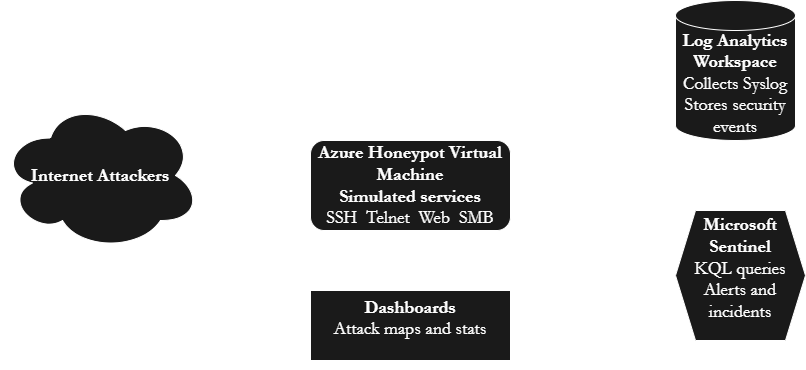

# Azure Honeypot SIEM Project

This project demonstrates how I deployed a Linux honeypot in Azure, exposed it to the public internet, collected Syslog events, ingested them into Microsoft Sentinel, and analyzed over **139,000+ real-world cyberattacks** using KQL, dashboards, and custom detections.

All images for this project are stored in:

`screenshots/Honeypot-Project/`

---

# Architecture Diagram

The following diagram shows the entire honeypot pipeline, including the Azure VM, NSG, Log Analytics Workspace, Data Collection Rule, Microsoft Sentinel, and the attacker traffic flow from the public internet.




---

# Overview

The goals of this project were to:

- Deploy a Linux honeypot VM in Azure  
- Ingest Syslog logs into Log Analytics  
- Connect Microsoft Sentinel as the SIEM  
- Analyze live attack traffic in real time  
- Build custom KQL queries for threat analysis  
- Create a custom SSH brute-force detection rule  
- Document the findings with screenshots  

This project demonstrates skills in cloud security, SIEM operations, Linux logging, KQL, automation, and threat analysis.

---

# Environment Setup

## Azure Virtual Machine
A publicly exposed Linux VM was deployed to attract automated internet attacks. SSH access was confirmed and logs were verified.


## Azure VM Overview
VM compute details, IP, region, subscription, OS type, and resource configurations were reviewed.


---

# Attack Traffic Collection

## Global Attack Map
Within hours of deployment, the honeypot began receiving attacks from around the world.


## Attack Details (Countries, IPs, Methods)
Traffic originated from over **20+ countries**, targeting SSH, web services, and other exposed ports.


---

# Network & Security Configuration

## Network Interface
Interface configuration for the honeypot VM.


## Network Security Group (NSG)
Inbound rules were intentionally kept open to allow attacker traffic for monitoring.


---

# Defender for Cloud Detection Rule

I created an SSH brute-force detection rule that triggers on repeated failed login attempts from the same IP.


## Rule Enabled
The specific detection rule is activated and monitoring the honeypot.


---

# Sentinel Workspace & Data Ingestion

## Sentinel Tables
Over **130+ tables** were available and integrated.


---

# Honeypot Attack Dashboards (Elastic)

## High-Level Dashboard
This dashboard shows total attacks per service, honeypot type, and distribution.

📌 **Total attacks recorded: 139,000+**


## Suricata Alerts & Attack Intelligence
Top exploited CVEs, attack signatures, attacker ASN information, and alert types.


## Honeypot Events by Type & OS Fingerprinting
Breakdown of honeypot interactions and attacker OS fingerprint guesses.


## Ports, Countries, and Alert Categories
Visualizations of the most attacked ports, countries of origin, and Suricata alert categories.


---

# Sentinel Syslog Ingestion Verified

Before analysis, I confirmed the Syslog table was receiving data.


---

# KQL Queries & Results

## 1. Top Processes by Event Count

```kusto
Syslog
| summarize eventCount = count() by ProcessName
| top 10 by eventCount desc
```


---

## 2. Top Attacking IP Addresses

```kusto
Syslog
| extend SourceIP = extract(@"\b(\d{1,3}(\.\d{1,3}){3})\b", 1, SyslogMessage)
| where isnotempty(SourceIP)
| summarize eventCount = count() by SourceIP
| top 10 by eventCount desc
```


---

## 3. Severity Level Distribution

```kusto
Syslog
| summarize eventCount = count() by SeverityLevel
| top 10 by eventCount desc
```


---

# Resource Group Overview

All resources used in the honeypot:


---

# Key Findings

- Over **139,000+ attacks** were recorded across the honeypot in four days.  
- Individual honeypot services received:  
  - **63,000+ Honeyptrap attacks**  
  - **38,000+ SentryPeer attacks**  
  - **29,000+ Cowrie attacks**  
  - 1,000+ attacks on Dionaea and Mailoney  
- Attack traffic originated from **20+ countries**, including the US, China, UK, Germany, Netherlands, France, Hong Kong, and Australia.  
- Suricata logs revealed real exploitation attempts against known CVEs.  
- KQL analysis confirmed attacker IPs, targeted processes, and severity levels.  
- The custom SSH brute-force detection rule successfully triggered.  

---

# Skills Demonstrated

### Cloud
- Azure VM deployment  
- NSG configuration  
- Log Analytics Workspace  
- Data Collection Rules  

### SIEM
- Microsoft Sentinel  
- KQL query development  
- Custom detection rules  
- Log analysis & threat hunting  

### Linux
- SSH access  
- Syslog analysis  
- Process monitoring  

### Security
- Understanding of attacker behavior  
- CVE exploitation detection  
- Suricata IDS analysis  

### Documentation
- Technical reporting  
- Markdown documentation  
- Architecture diagram design  

---

# Project Structure

```text
azure-honeypot-siem-sentinel-project
│
├── screenshots/
│   └── Honeypot-Project/
│       ├── HP-architecture.drawio.png
│       ├── Screenshot 2025-11-11 200538.png
│       ├── Screenshot 2025-11-12 001157.png
│       ├── Screenshot 2025-11-13 025459.png
│       ├── Screenshot 2025-11-13 025531.png
│       ├── Screenshot 2025-11-14 203201.png
│       ├── Screenshot 2025-11-14 203228.png
│       ├── Screenshot 2025-11-15 185232.png
│       ├── Screenshot 2025-11-15 210541.png
│       ├── Screenshot 2025-11-15 210742.png
│       ├── Screenshot 2025-11-15 214101.png
│       ├── Screenshot 2025-11-15 214137.png
│       ├── Screenshot 2025-11-15 214209.png
│       ├── Screenshot 2025-11-15 214238.png
│       ├── Screenshot 2025-11-15 214909.png
│       ├── Screenshot 2025-11-15 215237.png
│       ├── Screenshot 2025-11-15 215308.png
│       ├── Screenshot 2025-11-15 215352.png
│       ├── Screenshot 2025-11-15 215519.png
│       └── Screenshot 2025-11-15 215752.png
│
└── README.md
```

---
